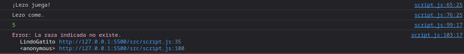

# Tarea 1-5. Clases en JavaScript

Para esta tarea, creo una clase 'LindoGatito' que cuenta con:

- Propiedades:
	- Nombre.
	- Fecha de nacimiento.
	- Raza.
	- Peso.

- Métodos:
	- Comer. El gato gana peso al realizar esta acción.
	- Jugar. El gato pierde peso al realizar esta acción.

Además, si el gato juega hasta pesar menos de un kilo o come hasta pesar más de 
quince, muere.

La implementación de esta clase con sus propiedades y métodos es la siguiente: 

```javascript
    class LindoGatito {

        #pesoMinimo = 1;
        #pesoMaximo = 15;
        #razas = [
            "gato común", "siamés", "abisino", "persa", "sphynx", "burmés", "british shorthair", "scottish fold",
            "siberiano", "curl americano", "oriental", "cartujo", "munchkin", "egipcio", "bobtail japonés"
        ];


        constructor( nombre, raza, peso ) {
            this._nombre = nombre;
            this._fechaNacimiento = new Date();
            this._estaVivo = true;

            if( this.#razas.includes(raza) ) this._raza = raza;
            else throw new Error("La raza indicada no existe.");
            
            if( typeof(peso) === "number" && this.#pesoMinimo <= peso && peso <= this.#pesoMaximo ) this._peso = peso;
            else throw new Error("El peso indicado es erróneo. Debe ser un entero entre 1 y 15 (inclusive).");
        }

        get nombre() {
            return this._nombre;
        }

        set nombre( valor ) {
            if( typeof(valor) === "string" ) this._nombre = valor;
            else throw new Error("El nombre del gato debe ser una cadena de texto.");
        }

        get peso() {
            return this._peso;
        }

        get raza() {
            return this._raza;
        }

        get fechaNacimiento() {
            return this._fechaNacimiento
        }

        juega() {
            if( this._estaVivo ) {
                this._peso -= 1;
                console.log(`¡${this._nombre} juega!`);
                this.#comprobarPeso();
            }
            else {
                console.log(`Tristemente ${this._nombre} ya no puede jugar más...`)
            }
        }

        come() {
            if( this._estaVivo ) {
                this._peso += 1;
                console.log(`${this._nombre} come.`); 
                this.#comprobarPeso();
            }
            else {
                console.log(`Tristemente ${this._nombre} ya no puede comer más...`)
            }
        }

        #comprobarPeso() {
            if( this._peso < this.#pesoMinimo ) {
                console.log("El gatito murió de inanición.");
                this._estaVivo = false;
            } else if( this._peso > this.#pesoMaximo ) {
                console.log("El gatito murió por sobrepeso.");
                this._estaVivo = false;
            }
        }
    }
```

> [!NOTE]
> Además de las propiedades y métodos requeridos, he añadido:
> 1. La propiedad 'estaVivo' para controlar si el gato ha fallecido.
> 2. Propiedades estáticas para realizar comprobaciones de raza y peso.
> 3. Setters y getters de las propiedades de instancia.
> 4. Un método privado 'comprobarPeso' que se encarga de determinar si el gato morirá.
> 5. Lanzamientos de excepciones en caso de que se indiquen datos incorrectos.


He creado dos instancias de la clase, comprobando con un bloque try...catch que se 
lanzan excepciones cuando es necesario y que el funcionamiento de los objetos de esta 
clase es adecuado:

```javascript
    gatito1 = new LindoGatito("Lezo", "gato común", 5);
    gatito1.juega();
    gatito1.come();
    console.log(gatito1.peso);
    try{
        gatito2 = new LindoGatito("Ámbar", "gato exótico", 23);
    }
    catch( excepcion ){
        console.log(excepcion)
    }
```

Y esto es lo que podemos observar desde la consola del navegador:



